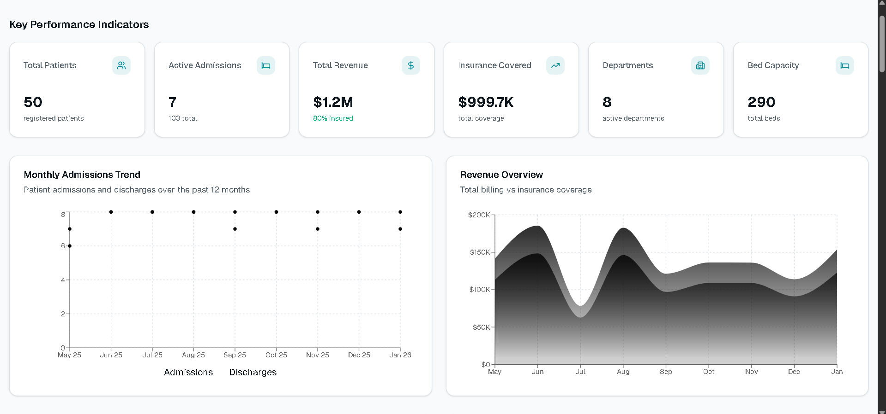

# 🚀 Mohammad Musahib Pasha - Portfolio

A modern, interactive portfolio website showcasing expertise in **data analytics** and **web development**.

## 📖 About

This portfolio highlights a dual expertise journey:
- **Data Analytics & SQL** — disciplined data work with structured analysis and analytics simulations
- **Web Development** — shipping clean, modern interfaces with React and cutting-edge CSS
- **MCA Student** at St Claret University, Bengaluru
- **Junior Web Developer** at ThoughtBot

Certifications include Deloitte Analytics (Forage), AWS ML Specialty, and MongoDB Atlas expertise.

**Live Site:** [portfolio-beige-ten-10.vercel.app](https://portfolio-beige-ten-10.vercel.app/)

## 🎨 Live Demo



## 🛠️ Tech Stack

- **React 19** + TypeScript — Component-based UI
- **Vite** — Lightning-fast build tool with HMR
- **Tailwind CSS** — Utility-first styling
- **Framer Motion** — Smooth animations & effects
- **Supabase** — Backend for contact form submissions
- **Vercel** — Deployment

## ✨ Features

- ✅ **Animated Hero Section** — Marquee badges of tech stack
- ✅ **About & Experience** — Career highlights and technical journey
- ✅ **Skills Showcase** — SQL, Python, React, MongoDB, AWS, and more
- ✅ **Certifications** — Verified credentials with direct links
- ✅ **Project Gallery** — Curated portfolio work
- ✅ **GitHub Integration** — Live GitHub stats
- ✅ **Contact Form** — Supabase-powered submissions
- ✅ **Smooth Animations** — Mouse spotlight, scroll progress, section reveals
- ✅ **Responsive Design** — Works on all devices
- ✅ **Loading Screen** — Polished UX on page load

## 🚀 Getting Started

```bash
# Install dependencies
npm install

# Start dev server
npm run dev

# Build for production
npm run build

# Preview production build
npm run preview
```

## 📧 Contact Form Setup

The contact form sends messages through a Vercel API route and [Resend](https://resend.com):

1. Create a Resend account and add `RESEND_API_KEY` in the Vercel project settings under Environment Variables.
2. For testing, the API uses `Portfolio <onboarding@resend.dev>` by default. Resend test mode only delivers to the email address associated with your Resend account.
3. For public submissions, verify a domain in Resend and set `CONTACT_FROM_EMAIL` to a sender on that domain, such as `Portfolio <contact@example.com>`.
4. Redeploy the Vercel project after changing environment variables.

Contact messages go to `musahibpasha4@gmail.com` by default. Set `CONTACT_TO_EMAIL` only if you want them sent to a different inbox. The Resend API key is only used by the server-side `/api/contact` function and must not use a `VITE_` prefix. Local Vite development does not run Vercel API functions; use `vercel dev` to test submissions locally.

## 📁 Project Structure

```
src/
├── components/
│   ├── effects/       # Animations (BadgeMarquee, MouseSpotlight)
│   ├── layout/        # Page layout (Navbar, Footer, LoadingScreen)
│   ├── sections/      # Content sections (Hero, About, Skills, Projects)
│   ├── icons/         # Social icons
│   └── ui/            # Reusable UI components
├── hooks/             # Custom hooks (useActiveSection)
├── lib/               # Utilities (Supabase, Motion)
├── config/            # Site configuration
└── App.tsx            # Main entry point
```

## 🔗 Links

- **Email:** musahibpasha4@gmail.com
- **GitHub:** [@MohammadMusahibPasha](https://github.com/musahibpashaa)
- **LinkedIn:** [Mohammad Musahib Pasha](https://www.linkedin.com/in/mohammad-musahib-pasha-04792425b/)

---

Built with ❤️ | Deployed on Vercel
